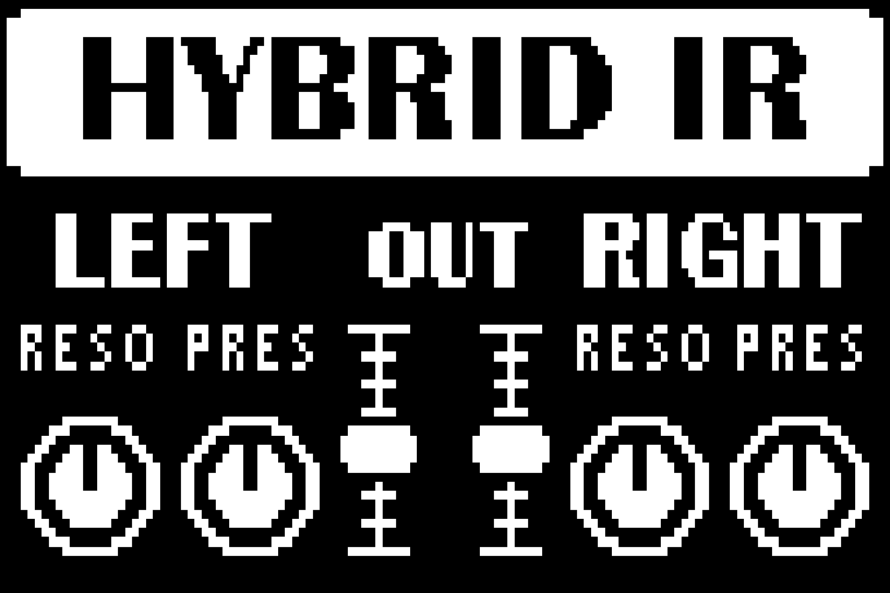

  

<h1 align="center">HYBRID IR</h1>

<strong>Ваш кабінет. Усередині вашого Zoom.</strong> 
Підготовка імпульсів, гібридна FIR/IIR-апроксимація та збирання власних ZDL.

  
  
  
  

<a href="README.md">English</a> · <a href="README.ru.md">Русский</a> · <strong>Українська</strong>

<h3 align="center"><a href="https://github.com/Leemuzhko/HYBRID-IR/releases">Завантажити для Windows</a></h3>

**[Standalone — рекомендовано](https://github.com/Leemuzhko/HYBRID-IR/releases)** · **[Lite — потрібен Python](https://github.com/Leemuzhko/HYBRID-IR/releases)**

Виберіть відповідний ZIP в Assets релізу. Обидва варіанти однієї версії мають однаковий код; розробницькі збірки — попередні. Download ZIP завантажує вихідний код, а не готову програму.

<a href="docs/uk/installation.md">Встановлення</a> · <a href="docs/uk/workflow.md">Створити перший ефект</a> · <a href="https://ko-fi.com/leemuzhko">Підтримати на Ko-fi</a>

MS-50G · MS-60B · MS-70CDR · G1on · G1Xon · B1on 
Лінійка пристроїв проєкту. Перевірка на обладнанні залежить від моделі й банку; див. технічний посібник.

---

Я розробляю HYBRID IR, щоб використовувати власні кабінетні імпульси в педалях Zoom. Можна завантажити звичайний IR або підібрати коротший FIR із додатковими IIR-фільтрами, а потім зібрати свої кабінети в один ZDL із перемиканням слотів. Інструменти безкоштовні; для звичайного патчингу компілятор TI не потрібен.

## Документація

Якщо хочеться спочатку спробувати готові ефекти, вони є в моєму репозиторії [Zoom-ZDL-FX](https://github.com/Leemuzhko/Zoom-ZDL-FX/tree/main/zdl/). Перед встановленням прочитайте опис вибраного ефекту й перевірте сумісність. HYBRID IR потрібен для підготовки власних банків.

- [Встановлення, оновлення та видалення](docs/uk/installation.md)
- [Підготовка IR та збирання банку](docs/uk/workflow.md)
- [Обмеження й технічні подробиці](docs/uk/technical.md)

## Швидкий старт

Встановіть програму, відкрийте **Zoom ZDL**, додайте імпульс через **Import WAV** і зберіть ефект кнопкою **Patch ZDL (no TI)**. Готовий ZDL завантажте через [Zoom Effect Manager](https://zoomeffectmanager.com/en/download/). Налаштування та перевірки описано в посібниках вище.

## Що нового у 0.4.1

Для **Patch ZDL (no TI) автоматично вибрано HIR3A**. Користувач підтвердив
роботу початкового синтетичного шаблону, збереження параметрів і результатів
патчера на MS-70CDR. Нові банки все одно перевіряйте на педалі.
Пакети програми містять лише HIR3A та його паспорт із контрольною сумою.

Доступна **K-weighted нормалізація**: окремо, з діапазоном 80–8000 Hz,
із Pink або разом із Pink та діапазоном. Це частотне зважування відгуку IR,
а не LUFS-метр із гейтингом. Попередні режими збережено; експорт не змінює
нормалізацію збереженої моделі приховано.

**Save as default** зберігає налаштування підготовки, включно з нормалізацією.
**Load defaults** відновлює їх; наступний запуск відновлює їх автоматично.
Це налаштування підготовки, не іменовані профілі чи параметри оптимізатора.
Інтерфейс програми доступний англійською та російською; документація — також українською.

Переносні проєкти та банки зберігають початкове аудіо для явної повторної
підготовки. Старі проєкти читаються. Зберігайте резервні копії: старі версії
програми можуть не підтримувати нові схеми з початковим аудіо.

Шаблон допускає **1–8 IR + OFF**, FIR **32–4096 taps**, до **32 BQ на запис**,
включно з RESO/PRES. Загальний бюджет має пріоритет: код 16 800 B,
константи до 12 104 B, включно з префіксом 1 672 B.
Два незалежні IR по 4096 taps у цей профіль **не вміщуються**.
Використовуйте до 5 видимих символів у назвах слотів.
Див. [технічний посібник](docs/uk/technical.md).

DSP cost **20** — не відсоток навантаження. Два довгі IR разом із підсилювачем
можуть перевантажити педаль. Скоротіть IR або використайте L/R і перевірте
весь ланцюжок на слух. IR OFF не вимикає всю обробку гілки.
Це кабінетна фільтрація, не модель підсилювача чи перевантаження.

## Підтримати проєкт

Якщо HYBRID IR вам корисний, можна [підтримати мою роботу на Ko-fi](https://ko-fi.com/leemuzhko). Це допомагає мені займатися розробкою, тестами й документацією. Інструменти залишаються безкоштовними; донат не купує функцій, пріоритетної підтримки чи строку випуску.

[Вихідний код і сторонні компоненти](docs/uk/technical.md) · [MIT](LICENSE) · [Third-party notices](THIRD_PARTY_NOTICES.md)
